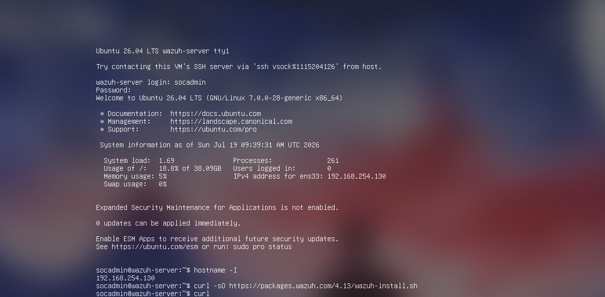
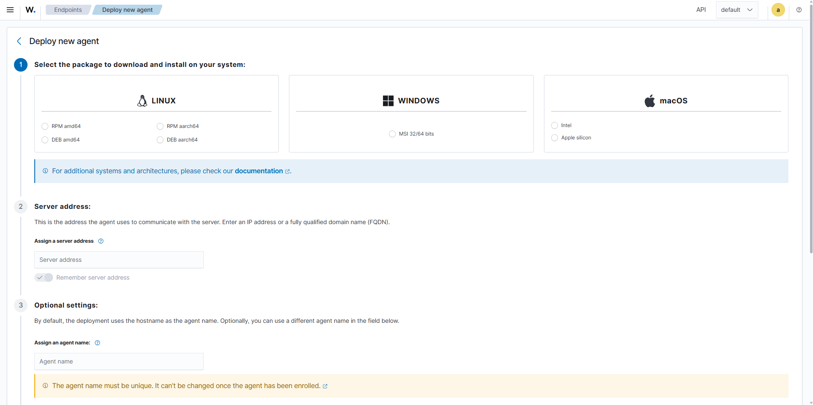
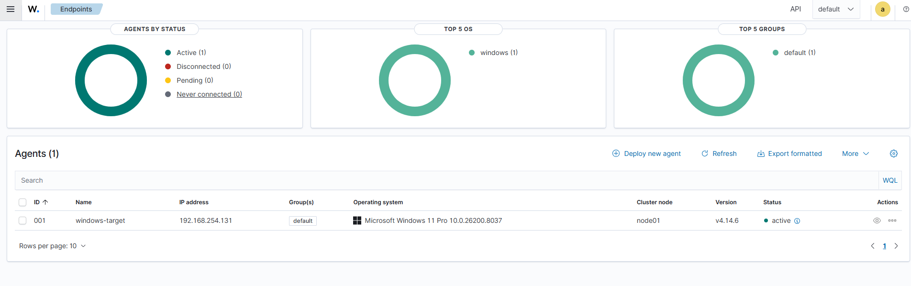
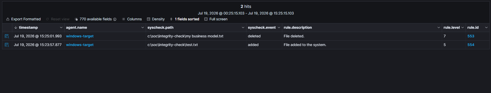

# Wazuh Home SOC Lab

## Project Overview

This project documents the design and implementation of a small Security Operations Center lab built with Wazuh, Ubuntu Server, Windows 11, Sysmon, VMware Workstation, and Parrot OS.

The lab was created to simulate common SOC workflows in a controlled environment. It provides a practical way to generate security events, collect endpoint telemetry, investigate alerts, and understand how attacker activity leaves evidence in system logs.

### Project Goals

- Monitor endpoint activity
- Collect and analyze Windows logs
- Use Sysmon for detailed endpoint telemetry
- Build and test custom Wazuh detections
- Configure file integrity monitoring
- Practice threat hunting and alert investigation
- Generate controlled attack activity inside an isolated lab
- Identify the artifacts created by suspicious activity
- Map detections to the MITRE ATT&CK framework

The final environment collects activity from a Windows endpoint through Sysmon and the Wazuh agent. The Wazuh manager processes the events, the indexer stores them, and the dashboard provides a central interface for analysis.

## Project Status

### Completed

- [x] Created the Ubuntu Server virtual machine
- [x] Installed the Wazuh all-in-one deployment
- [x] Configured the Wazuh manager, indexer, and dashboard
- [x] Created the Windows 11 virtual machine
- [x] Installed VMware Tools
- [x] Deployed the Wazuh Windows agent
- [x] Confirmed the Windows agent was active
- [x] Installed Sysmon on Windows
- [x] Added the Sysmon event channel to the Wazuh agent configuration
- [x] Confirmed Sysmon alerts were reaching Wazuh
- [x] Created a custom Notepad process detection rule
- [x] Configured File Integrity Monitoring
- [x] Enabled real-time monitoring for a custom directory

### Planned Improvements

- [ ] Detect repeated RDP authentication failures
- [ ] Create a brute-force correlation rule
- [ ] Test Wazuh Active Response
- [ ] Add more Sysmon-based detections
- [ ] Configure email or webhook notifications
- [ ] Enable vulnerability detection
- [ ] Review Security Configuration Assessment results
- [ ] Create custom dashboard views

## Lab Architecture

```text
                         VMware Workstation

       ┌──────────────────────────────────────────────┐
       │                                              │
       │    ┌───────────────────────────────────┐     │
       │    │ Ubuntu Server                     │     │
       │    │                                   │     │
       │    │ Wazuh Manager                     │     │
       │    │ Wazuh Indexer                     │     │
       │    │ Wazuh Dashboard                   │     │
       │    └───────────────┬───────────────────┘     │
       │                    │                         │
       │          VMware NAT Network                  │
       │                    │                         │
       │    ┌───────────────┴───────────────────┐     │
       │    │ Windows 11                        │     │
       │    │                                   │     │
       │    │ Wazuh Agent                       │     │
       │    │ Sysmon                            │     │
       │    │ File Integrity Monitoring         │     │
       │    └───────────────────────────────────┘     │
       │                                              │
       │    ┌───────────────────────────────────┐     │
       │    │ Parrot OS                         │     │
       │    │                                   │     │
       │    │ Controlled testing system         │     │
       │    └───────────────────────────────────┘     │
       │                                              │
       └──────────────────────────────────────────────┘
```

## 1. Installing Ubuntu Server

Ubuntu Server AMD64 was installed on the virtual machine that hosts the Wazuh components.

During installation:

- OpenSSH Server was enabled
- A local administrative user was created
- The virtual machine remained connected to the VMware NAT network

The Ubuntu IP address was identified with:

```bash
hostname -I
```

The server was then managed from Windows PowerShell over SSH:

```powershell
ssh <ubuntu-user>@<wazuh-server-ip>
```

## 2. Installing the Wazuh Server

The Wazuh all-in-one deployment method was used. It installed:

- Wazuh Manager
- Wazuh Indexer
- Wazuh Dashboard
- Filebeat
- Certificates
- Internal Wazuh users

The installation was completed from the Ubuntu terminal.




## 3. Accessing the Wazuh Dashboard

The Wazuh dashboard was accessed from the Windows host through a web browser.


*Replace `placeholder-wazuh-dashboard.png` with a screenshot of the Wazuh dashboard.*

## 4. Installing Windows 11

A Windows 11 virtual machine was created in VMware Workstation using an official Microsoft ISO.

This machine acts as the monitored endpoint in the lab.

## 5. Deploying the Wazuh Windows Agent

The agent deployment wizard was opened from:

```text
Agents Management → Summary → Deploy New Agent
```




The generated PowerShell command was copied and executed from an elevated PowerShell window on the Windows virtual machine.

The Wazuh service was started with:

```powershell
Start-Service WazuhSvc
```

Its status was verified with:

```powershell
Get-Service WazuhSvc
```

Expected result:

```text
Status: Running
```

The Windows agent then appeared as `Active` in the Wazuh dashboard.




## 6. Installing Sysmon

A working directory was created on the Windows endpoint:

```powershell
New-Item -ItemType Directory -Path C:\SOC\Sysmon -Force
Set-Location C:\SOC\Sysmon
```

Sysmon was downloaded and extracted:

```powershell
Invoke-WebRequest `
  -Uri "https://download.sysinternals.com/files/Sysmon.zip" `
  -OutFile "C:\SOC\Sysmon\Sysmon.zip"

Expand-Archive `
  -Path "C:\SOC\Sysmon\Sysmon.zip" `
  -DestinationPath "C:\SOC\Sysmon" `
  -Force
```

The [Sysmon Modular configuration](https://github.com/olafhartong/sysmon-modular) by Olaf Hartong was used as a starting point.

Sysmon was installed with:

```powershell
C:\SOC\Sysmon\Sysmon64.exe `
  -accepteula `
  -i C:\SOC\Sysmon\sysmonconfig.xml
```

## 7. Verifying Sysmon Events Locally

Sysmon events were reviewed in Windows Event Viewer at:

```text
Applications and Services Logs
└── Microsoft
    └── Windows
        └── Sysmon
            └── Operational
```

This confirmed that Sysmon was collecting process, file, registry, and network telemetry on the Windows endpoint.

## 8. Configuring Wazuh to Collect Sysmon

The Wazuh agent configuration file is located at:

```text
C:\Program Files (x86)\ossec-agent\ossec.conf
```

Because the file is stored under `Program Files (x86)`, it was opened from an elevated PowerShell session:

```powershell
notepad "C:\Program Files (x86)\ossec-agent\ossec.conf"
```

The following block was added before the final `</ossec_config>` tag:

```xml
<localfile>
  <location>Microsoft-Windows-Sysmon/Operational</location>
  <log_format>eventchannel</log_format>
</localfile>
```

The Wazuh agent service was restarted:

```powershell
Restart-Service WazuhSvc
```

The Threat Hunting dashboard was then used to confirm that Sysmon events were reaching Wazuh.


*Replace `placeholder-wazuh-sysmon-events.png` with a screenshot showing Sysmon events in Wazuh Threat Hunting.*

## 9. Configuring File Integrity Monitoring

A custom directory was created on the Windows endpoint:

```powershell
New-Item `
  -ItemType Directory `
  -Path "C:\SOC\integrity-check" `
  -Force
```

The Wazuh agent configuration was reopened as Administrator:

```powershell
notepad "C:\Program Files (x86)\ossec-agent\ossec.conf"
```

Inside the existing `<syscheck>` section, the following entry was added:

```xml
<directories realtime="yes"
             check_all="yes"
             report_changes="yes">C:\SOC\integrity-check</directories>
```

This configuration enables real-time monitoring and records supported file changes inside the custom directory.

## 10. Testing File Integrity Monitoring

A test file was created:

```powershell
"First version" |
Set-Content "C:\SOC\integrity-check\test.txt"
```

The file was then modified:

```powershell
"Second version" |
Add-Content "C:\SOC\integrity-check\test.txt"
```

A separate sample file named `My business model` was also deleted to generate a file deletion event.

The resulting Wazuh events demonstrated detection of:

- File creation
- File modification
- File deletion
- Attribute changes
- Content changes for supported text files




## 11. Skills Demonstrated

This project demonstrates practical experience with:

- VMware Workstation
- Linux server administration
- Windows administration
- SSH
- PowerShell
- Security monitoring
- Wazuh deployment
- Endpoint agent deployment
- Sysmon configuration
- Windows Event Logs
- XML configuration
- File Integrity Monitoring
- Threat hunting
- Alert analysis
- Troubleshooting

## 12. Future Improvements

Planned extensions include:

1. Detect repeated Windows authentication failures
2. Detect suspicious PowerShell commands
3. Detect encoded PowerShell execution
4. Detect newly created local administrator accounts
5. Monitor changes to sensitive Windows directories
6. Map custom detections to MITRE ATT&CK
7. Test Wazuh Active Response
8. Create custom Wazuh dashboard visualizations
9. Integrate TheHive, Shuffle, or MISP

## Keywords

`wazuh` · `siem` · `cybersecurity` · `sysmon` · `windows-event-log` · `threat-detection` · `mitre-attack` · `soc` · `log-analysis` · `blue-team` · `filebeat` · `endpoint-security` · `log-monitoring` · `event-correlation` · `homelab` · `vmware` · `parrot-os`
